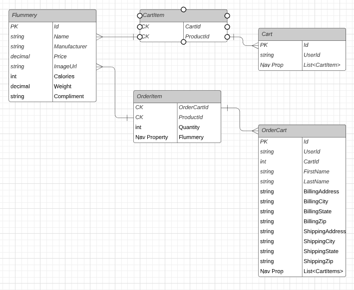

# Lab 26 - ECommerce App

*Authors: Paul Rest & Nicco Ryan*

[Live Site](https://flummeryflummeries.azurewebsites.net/)

----

### Description

A ASP.Net MVC wep app for showing a selection of Flummery Flummeries, i.e. flummery dessert with a flummery compliment, for sale.

Employs ASP.Net Core Identity and Authentication to allow users to create users, log in, and for certain functionalities to be locked down for admins. Captures a user's supplied Full Name as a claim on registration to display to them in the navbar.

Anonymous users are able to view the products available on the site but only logged in user's have a cart that can be added to and checked out. The admin has the ability to do full CRUD operations on all products. This is achieved with an Admin role-based policy used on pages that update product info, and allow anonymous being added to the home and product pages.

Front-end is dynamically rendered using a mixture of MVC with Views and MVVM with Razor Pages.

Dependency injection is used on all controllers and Razor Pages, structured off the Repository Design pattern where interfaces are created for all services which are then given concrete implementations for all necessary concrete services.

The site processes pseudo-payments via the use of AuthorizeNet sandbox, and sends emails upon registration and successful checkout via SendGrid.

*Admin Username* : Admin@admin.com

*Admin Password* : @Test123! 

---

### Database ERD



#### Explanation
*Flummery* : The main products table, contains all the flummeries and their associated information. The ids for these are used to create the Cart and OrderCart Items.

*Cart* : A user's cart, tied to them by the userId that the Identity Framework assigns to them on registration. Carts are created when an items is added and a cart is not found, and deleted either when all items are removed from the cart or a checkout is processed successfully, at which point it will be transferred to the Orders table. Carts contain a Nav Property for all associated CartItems.

*CartItems* : Joint Entry Table with Payload of quantity used to tie together the many-to-many relationship between Products and Carts. Contains a composite key with a CartId and ProductId

*Order* : Essentially the same as the cart table but it is used to store completed orders with all the shipping and billing info tied to that order. Contains an Id and a UserId, as well as the Nav Property for all of the OrderCartItems. This table is used to display a user's order history to them.

*OrderItem* : Joint Entry Table with Payload of quantity, used to tie together the many-to-many relationship between Products and OrderCarts. Contains a composite key with a OrderCartId and ProductId. This table contains all the items in each order of a user's order history.


---

### Getting Started
Clone this repository to your local machine.

In a command line environment with Git installed:

```
git clone https://ECommerce-App@dev.azure.com/ECommerce-App/ECommerce-App/_git/ECommerce-App
```

### To Run the Program Locally from Visual Studio (2019):

#### Download and Open Project

Select ```File``` -> ```Open``` -> ```Project/Solution```

Next navigate to the directory you cloned the repository to.

Double click on the ```ECommerce-App``` directory.

Then select and open ```ECommerce-App.sln```

#### Get Project Ready to Run Locally

Open the Package Manager Console (```View -> Other Windows -> Package Manager Console``` or on Windows, Alt + V + E + O). If Migrations folder is present, you can skip the next step.

Create the database migrations by entering into the Package Manager Console: ```add-migration -context StoreDbContext <<MIGRATION NAME>>``` and ```add-migration -context UserDbContext <<MIGRATION NAME>>``` where "MIGRATION NAME" is a designation of your choosing.

Update/create the databases by entering into the Package Manager Console: ```update-database -context StoreDbContext``` and ```update-database -context UserDbContext```.

Confirm that the databases have been created and are seeded with data.

#### Run

Select ```Debug``` -> ```Start Debugging``` to the run the app with the debugger

OR

Select ```Debug``` -> ```Start Without Debugging```

---

### Version

v1.8

### Change Log

#### 2020-08-23
- Overhaul of Image uploads and Flummery creation, Admin now can upload Flummeries via the upload item in the top-right dropdown, and upload/update individual images via the link on the item in the products page.

#### 2020-08-20
- Completion of Checkout process (using pseudo-cards and AuthorizeNet sandbox).
- Created nice templates on SendGrid for both registration and receipt emails.
- Completed confirmation page for order processing showing users information about the order and the success message.

#### 2020-08-19
- Started creation of checkout process using AuthorizeNet and added OrderCarts and OrderCartItems tables to the database.

#### 2020-08-18
- Added user carts along with the ability to add items, update and remove items in them. 
- Cart view page for showing all cart items and View Component for showing mini cart on other pages created, toggleable by pressing cart icon in top right.

#### 2020-08-17
- Integrated SendGrid to send user's an email upon registration.
- Created Product Details pages for viewing a specific product

#### 2020-08-15
- Converted app's services to using entity objects rather than View Models after encountering complexities with VMs

#### 2020-08-13
- Completed Image Upload Service.
- Added Administrator role and authorized routes to appropriate policies.

#### 2020-08-12
- Started image upload service.
- Overhauled UI for a better experience.

#### 2020-08-11
- Added InventoryManagement service.
- Added user handling including registration, login and logout.

#### 2020-08-10
- Initial version using CSV for products.

